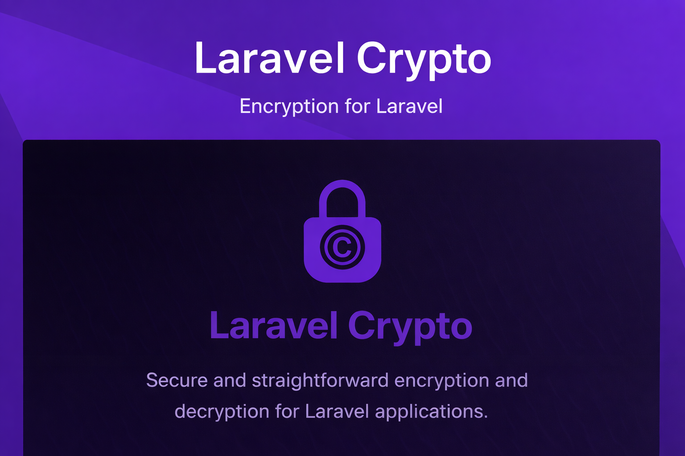

<p align="center">
  <a href="https://packagist.org/packages/akira/laravel-crypto"></a>
  <a href="https://github.com/akira-io/laravel-crypto/actions?query=workflow%3Arun-tests+branch%3A1.x"></a>
  <a href="https://packagist.org/packages/akira/laravel-crypto"></a>
  <a href="https://packagist.org/packages/akira/laravel-crypto"></a>
  <a href="https://github.com/akira-io/laravel-crypto/blob/1.x/LICENSE.md"></a>
</p>

`Laravel Crypto` is a Laravel package designed to make encryption and decryption straightforward. It supports:

- **Secure encryption** using modern algorithms such as `AES-256-CBC`.
- **Customizable configuration**, allowing you to define key sizes, algorithms, iterations, and more.
- **Effortless integration** with Laravel's configuration and service container.
- **Randomized Initialization Vectors (IVs)** for enhanced encryption security.

Whether you're building an application that requires secure data storage, transmitting sensitive information, or complying with data protection regulations, Laravel Crypto has you covered.

## Quick Start

### Installation

```bash
composer require akira/laravel-crypto
```

### Generate Key

```bash
php artisan crypto:generate-key
```

Add to your `.env`:
```env
CRYPTO_ENCRYPTION_KEY=your-generated-key-here
```

### Usage

```php
// Using helper function (recommended - has IDE autocomplete ⭐)
$encrypted = crypto()->encrypt('Hello World');
$decrypted = crypto()->decrypt($encrypted);

// Or using facade
use Akira\LaravelCrypto\Facades\Crypto;
$encrypted = Crypto::encrypt('Hello World');
$decrypted = Crypto::decrypt($encrypted);
```

## Documentation

- 📖 [Complete Documentation](docs/00-index.md)
- ⭐ [Helper Function Usage](docs/11-helper-usage.md) - **Recommended with IDE autocomplete**
- 🚀 [Quick Start Guide](docs/01-introduction.md)
- 📝 [API Reference](docs/07-api-reference.md)
- 💡 [Examples](docs/06-examples.md)
- 🔒 [Security Best Practices](docs/08-security-best-practices.md)

## Changelog

Please see [CHANGELOG](CHANGELOG.md) for more information on what has changed recently.

## Contributing

Please see [CONTRIBUTING](CONTRIBUTING.md) for details.

## Security Vulnerabilities

Please review [our security policy](../../security/policy) on how to report security vulnerabilities.

## Credits

- [kidiatoliny](https://github.com/kidiatoliny)
- [All Contributors](../../contributors)

## License

The MIT License (MIT). Please see [License File](LICENSE.md) for more information.
